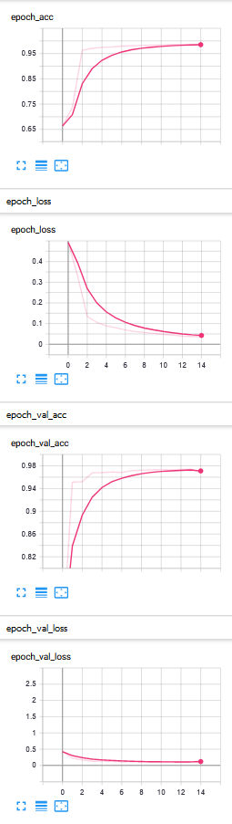
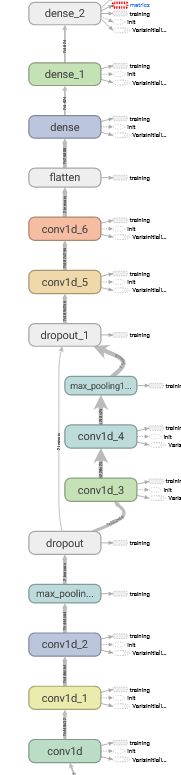

# Heartbeat Detector

## Overview
* A machine learning project to classify heartbeats from ECG. 
* Highest accuracy 97%
* Data from the MIT-BIH heartbeat database: https://physionet.org/physiobank/database/mitdb/

## Pre-Processing
* Uses the wfdb library to help with pre-processing the raw files.
* Each heartbeat is extracted using QRS detection.
* The respective label is found from the .atr file and applied to the heartbeat. 
* The heartbeats get edge padded to be 450 samples long. (Sample Rate 360hz)
* The related files are readData.py and filterData.py

A sample of the training data

## Learning
* CNN's appear to be the most effective way to classify the data.
* Train/Test split of 70/30.
* Built using Keras/TensorFlow.

Results             |  Network
:-------------------------:|:-------------------------:
  |  

## Future Work
* Expand data set to use more sources with similar classification scheme. 
* Apply new ML methods to achieve higher accuracy. 
* With more data, potentially see if model can be trained on one data set, then applied to a different one while maintaining accuracy. 
